# 🏥 HYGEIA 1.0 - IoT Health Monitoring & Medication System
This Project shows for IGNITE-2026 in General Sir John  Kotelawala Defence University

> **"Empowering elderly care with real-time monitoring and automated assistance."**

**HYGEIA 1.0** is a dual-device IoT ecosystem designed to assist patients and caregivers. It consists of a **Smart Glove** that monitors vital signs and a **Smart Medication Supply Unit** that automates pill dispensing. The two devices communicate directly via ESP-NOW to ensure the patient is alerted via haptic feedback when it is time to take medication.

---

## 🧠 System Architecture

The system operates on a hybrid communication model using **WiFi (Cloud/Web)** and **ESP-NOW (Device-to-Device)**.

```mermaid
graph TD
    subgraph "Patient Environment"
        style G fill:#e1f5fe,stroke:#01579b,stroke-width:2px
        style M fill:#fff3e0,stroke:#e65100,stroke-width:2px
        
        G[🧤 Smart Glove]
        M[💊 Med Supply Unit]
        
        P((Patient))
    end

    subgraph "Cloud & Connectivity"
        style T fill:#e8f5e9,stroke:#2e7d32,stroke-width:2px
        
        R[WiFi Router]
        T[Telegram API]
        N[NTP Server]
    end

    subgraph "Caregiver Dashboard"
        U[📱 Caregiver / Doctor]
        W_G[🌐 Glove Web Dashboard]
        W_M[🌐 Med Scheduler Web]
    end

    %% Relationships
    P -- "Wears" --> G
    P -- "Retrieves Meds" --> M

    %% Glove Connections
    G -- "Reads Vitals (I2C/OneWire)" --> Sensors[MAX30102 & DS18B20]
    G -- "Displays Data" --> OLED[SH1106 Display]
    G -- "HTTPS Alerts" --> T
    G -- "Host Web Server" --> W_G
    
    %% Med Unit Connections
    M -- "Syncs Time" --> N
    M -- "Controls" --> Stepper[Stepper Motor]
    M -- "Host Web Server" --> W_M
    
    %% Device to Device
    M -- "ESP-NOW (Trigger Vibration)" --> G
    G -- "Haptic Feedback" --> Vib[Vibration Motor]

    %% User Interactions
    T -- "Emergency Alerts" --> U
    U -- "View Vitals" --> W_G
    U -- "Set Schedule" --> W_M
```



---

## 🧤 Device 1: The Smart Glove (`smartglove.ino`)

A wearable device that continuously tracks health metrics and serves as a panic button.

### ✨ Features
*   **Vitals Monitoring**: Real-time Heart Rate (BPM), Blood Oxygen (SpO2), and Body Temperature.
*   **OLED Display**: Shows live data, battery status, and connection info.
*   **Telegram Integration**: Sends instant alerts to caregivers if vitals go out of range or if the panic button is pressed.
*   **Haptic Feedback**: Vibrates when the Medication Unit signals a scheduled dose.
*   **Web Dashboard**: Hosts a local web page to view live vitals charts.

### 🛠 Hardware Required
*   **Microcontroller**: ESP32 Development Board
*   **Sensors**: MAX30102/MAX30105 (Pulse Oximeter), DS18B20 (Temperature)
*   **Display**: 1.3" OLED (SH1106/SH110X)
*   **Actuators**: Vibration Motor (Coin cell type)
*   **Input**: Push buttons (Panic/Status)

---

## 💊 Device 2: Med Supply Unit (`medsupply.ino`)

An automated pill dispenser that manages the medication schedule.

### ✨ Features
*   **Automated Dispensing**: Rotates a stepper motor to drop pills at scheduled times.
*   **Web Scheduler**: A clean web interface to set medication times (up to 12 slots).
*   **NTP Time Sync**: Synchronizes with internet time servers for precision.
*   **Remote Trigger**: Sends a wireless signal (ESP-NOW) to the Smart Glove to vibrate and alert the patient.
*   **Manual Override**: Physical button or web button to dispense immediately.

### 🛠 Hardware Required
*   **Microcontroller**: ESP32 Development Board
*   **Motor**: Stepper Motor (e.g., NEMA 17 or 28BYJ-48) + Driver (A4988/ULN2003)
*   **Indicators**: LEDs (Status/Message)

---

## 🚀 Getting Started

### 1. Prerequisites (Arduino IDE)
Install the following libraries via the Arduino Library Manager:
*   `Adafruit GFX Library`
*   `Adafruit SH110X`
*   `SparkFun MAX3010x Pulse and Proximity Sensor Library`
*   `DallasTemperature`
*   `OneWire`
*   `UniversalTelegramBot`
*   `ArduinoJson`

### 2. Configuration

#### Step A: Configure the Smart Glove
Open `smartglove.ino` and edit the following lines:
```cpp
// WiFi Credentials
const char* WIFI_SSID = "YOUR_WIFI_SSID";
const char* WIFI_PASSWORD = "YOUR_WIFI_PASSWORD";

// Telegram Bot (Get from BotFather)
#define BOT_TOKEN "YOUR_TELEGRAM_BOT_TOKEN"
const char* CHAT_IDS[NUM_RECIPIENTS] = { "CHAT_ID_1", "CHAT_ID_2" };
```
*Upload this code to the Glove ESP32 and open the Serial Monitor to find its MAC Address.*

#### Step B: Configure the Med Supply Unit
Open `medsupply.ino` and edit the following:
```cpp
// WiFi AP Password (for the scheduler interface)
const char* password = "YOUR_SECURE_PASSWORD";

// Target MAC Address (The Glove's MAC Address found in Step A)
uint8_t receiverMAC[] = {0xAB, 0xCD, 0xEF, 0x12, 0x34, 0x56}; 
```

---

## 📖 Usage Guide

### Setting a Schedule
1.  Power on the **Med Supply Unit**.
2.  Connect your phone/laptop to the WiFi AP named **"Time Scheduler"**.
3.  Navigate to `http://192.168.4.1` in your browser.
4.  Add time slots (Hours:Minutes) for medication and click **Set Schedule**.

### Monitoring Vitals
1.  Power on the **Smart Glove**.
2.  Ensure the patient places their finger on the sensor.
3.  The OLED will display BPM, SpO2, and Temp.
4.  If values are critical (e.g., SpO2 < 95%), a **Telegram Alert** is sent immediately.

### Taking Medication
1.  When a scheduled time is reached:
    *   The **Med Supply Unit** rotates the motor to dispense the pill.
    *   It sends a signal to the **Smart Glove**.
    *   The **Smart Glove vibrates**, alerting the patient even if they are in another room.

---

## 📜 License
This project is open-source. Feel free to modify and improve!

